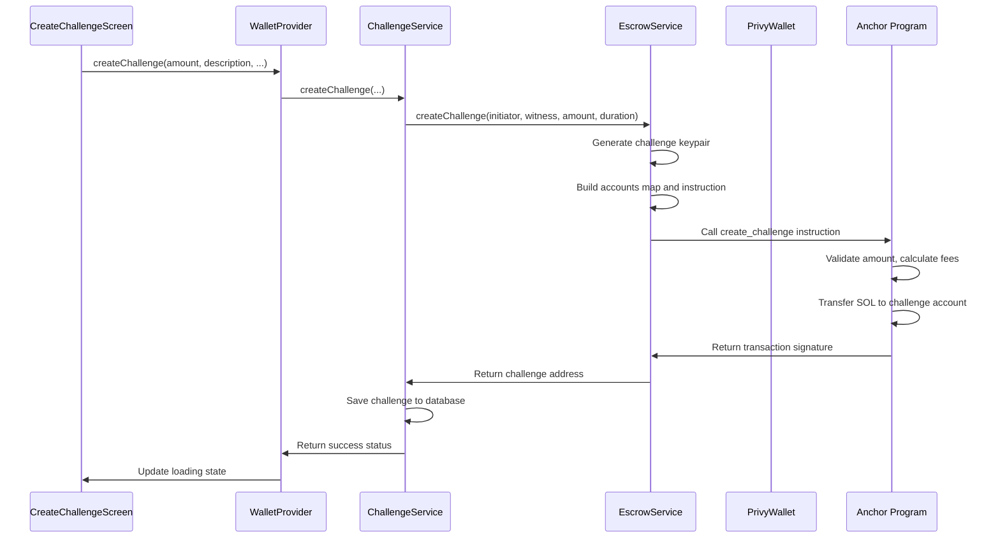
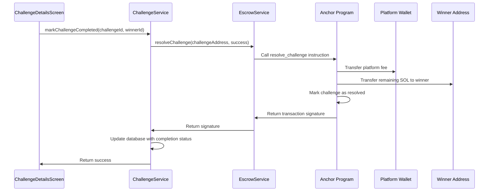

# Chumbucket Escrow Integration with dart-coral-xyz

## Overview

This document outlines the complete implementation of robust blockchain integration between the Chumbucket Flutter app and the Anchor escrow program using `dart-coral-xyz`. The integration provides type-safe, production-ready interactions with Solana blockchain.

## Architecture

### 🏗️ System Components

```
┌─────────────────────────────────────────────────────────────────┐
│                    FRONTEND LAYER                                │
├─────────────────────────────────────────────────────────────────┤
│  Flutter UI (Challenge Creation/Management)                     │
│  ├─ CreateChallengeScreen: User input for challenges            │
│  ├─ ChallengeDetailsScreen: Display challenge status            │
│  ├─ EscrowDebugScreen: Integration testing interface            │
│  └─ HomeScreen: Challenge list and navigation                   │
└─────────────────────────────────────────────────────────────────┘
                              ↓
┌─────────────────────────────────────────────────────────────────┐
│                   PROVIDER LAYER                                │
├─────────────────────────────────────────────────────────────────┤
│  WalletProvider: State management and wallet operations         │
│  ├─ Privy wallet initialization                                 │
│  ├─ Balance management                                          │
│  ├─ Transaction orchestration                                   │
│  └─ Challenge lifecycle coordination                            │
└─────────────────────────────────────────────────────────────────┘
                              ↓
┌─────────────────────────────────────────────────────────────────┐
│                   SERVICE LAYER                                 │
├─────────────────────────────────────────────────────────────────┤
│  ChallengeService: Business logic orchestration                 │
│  ├─ Fee calculation (progressive: 10% → 2% as stake increases)  │
│  ├─ Database persistence coordination                           │
│  ├─ On-chain/off-chain data synchronization                     │
│  └─ Challenge lifecycle management                              │
│                                                                 │
│  EscrowService: Direct blockchain interactions                  │
│  ├─ dart-coral-xyz program integration                          │
│  ├─ Type-safe instruction calls                                 │
│  ├─ Account data fetching and parsing                           │
│  └─ Transaction building and execution                          │
│                                                                 │
│  PrivyWallet: Transaction signing bridge                        │
│  ├─ Implements dart-coral-xyz Wallet interface                  │
│  ├─ Handles Privy embedded wallet signing                       │
│  ├─ Message/transaction signature coordination                   │
│  └─ Error handling and retry logic                              │
└─────────────────────────────────────────────────────────────────┘
                              ↓
┌─────────────────────────────────────────────────────────────────┐
│                  BLOCKCHAIN LAYER                               │
├─────────────────────────────────────────────────────────────────┤
│  dart-coral-xyz: Type-safe Solana program interaction          │
│  ├─ Program: Main interface for method calls                    │
│  ├─ AnchorProvider: Connection + wallet management              │
│  ├─ Connection: RPC client for blockchain communication         │
│  └─ IDL: Type definitions from Anchor program                   │
│                                                                 │
│  chumbucket_escrow: Anchor program on Solana                    │
│  ├─ create_challenge: Escrows SOL, deducts platform fee        │
│  ├─ resolve_challenge: Distributes funds based on outcome       │
│  ├─ Challenge account: Stores challenge state on-chain          │
│  └─ Platform fee logic: Progressive fee structure               │
└─────────────────────────────────────────────────────────────────┘
```

## Key Implementation Files

### 1. EscrowService (`lib/services/escrow_service.dart`)
- **Purpose**: Direct interface to chumbucket-escrow Anchor program
- **Features**:
  - Type-safe program initialization with IDL loading
  - `createChallenge()`: Creates challenge on-chain with SOL escrow
  - `resolveChallenge()`: Executes resolution with fund distribution
  - `getChallengeData()`: Fetches and parses on-chain challenge state
  - Automatic lamports ↔ SOL conversion for user-friendly amounts

### 2. ChallengeService (`lib/services/challenge_service.dart`)
- **Purpose**: Business logic orchestration between UI and blockchain
- **Features**:
  - Progressive fee calculation (10% → 2% as stakes increase)
  - Database + blockchain synchronization
  - Challenge lifecycle management
  - Error handling and transaction retry logic

### 3. PrivyWallet (`lib/services/privy_wallet.dart`)
- **Purpose**: Bridge between dart-coral-xyz and Privy embedded wallet
- **Features**:
  - Implements `Wallet` interface required by dart-coral-xyz
  - Handles transaction and message signing via Privy
  - Base64 encoding/decoding for signature compatibility
  - Comprehensive error handling for wallet operations

### 4. WalletProvider (`lib/providers/wallet_provider.dart`)
- **Purpose**: Flutter state management for wallet operations
- **Features**:
  - Privy wallet initialization and management
  - Balance tracking and updates
  - Challenge creation orchestration
  - Loading states and error handling for UI

## Data Flow

### Challenge Creation Flow



### Challenge Resolution Flow



## Program Details

### Anchor Program: chumbucket_escrow

**Program ID**: `Es4Z5VVh54APWZ2LFy1FRebbHwPpSpA8W47oAfPrA4bV`

#### Instructions

1. **create_challenge**
   - **Accounts**: initiator (signer), witness, challenge (new account), system_program
   - **Arguments**: amount (u64), deadline (i64)
   - **Logic**:
     - Validates minimum stake (0.01 SOL)
     - Calculates progressive platform fee
     - Transfers SOL from initiator to challenge account
     - Stores challenge metadata on-chain

2. **resolve_challenge**
   - **Accounts**: challenge, initiator (signer), witness, platform_wallet
   - **Arguments**: success (bool)
   - **Logic**:
     - Validates challenge is not already resolved
     - Transfers platform fee to platform wallet
     - Transfers remaining SOL to winner (initiator if success=true, witness if false)
     - Marks challenge as resolved

#### Challenge Account Structure

```rust
pub struct Challenge {
    pub initiator: Pubkey,      // Challenge creator
    pub witness: Pubkey,        // Challenge verifier/participant  
    pub amount: u64,            // Net amount after fees (lamports)
    pub original_amount: u64,   // Original amount before fees (lamports)
    pub platform_fee: u64,      // Platform fee amount (lamports)
    pub deadline: i64,          // Unix timestamp
    pub resolved: bool,         // Resolution status
}
```

#### Fee Structure

The program implements a progressive fee structure that benefits users with larger stakes:

- **≤ 10 SOL**: 10% platform fee
- **10-50 SOL**: ~6.67% platform fee  
- **50-100 SOL**: 5% platform fee
- **> 100 SOL**: 4% platform fee

## Environment Configuration

### Required Environment Variables

```bash
# RPC endpoints
LOCAL_RPC_URL=http://127.0.0.1:8899          # Local validator
SOLANA_RPC_URL=https://api.devnet.solana.com  # Devnet fallback

# Platform configuration  
PLATFORM_WALLET_ADDRESS=3yHQosvdAhoFZHs66iFcdfRuT2aApAu6Yst2yoeDNjZm

# Privy configuration
APP_ID=your_privy_app_id
APP_SECRET=your_privy_app_secret

# Supabase configuration
SUPABASE_URL=your_supabase_url
SUPABASE_ANON_KEY=your_supabase_anon_key
```

## Development Setup

### 1. Start Local Validator

```bash
# Start fresh local validator
solana-test-validator --reset

# In separate terminal: Deploy program
cd chumbucket-escrow
anchor build
anchor deploy --provider.cluster localnet
```

### 2. Update IDL

```bash
# Copy latest IDL to Flutter app
cp chumbucket-escrow/target/idl/chumbucket_escrow.json chumbucket/assets/chumbucket_escrow_idl.json
```

### 3. Test Integration

The app includes a debug screen accessible via the science icon (🧪) in the home screen AppBar:

- **Initialize Service**: Test EscrowService setup
- **Create Challenge**: Test on-chain challenge creation  
- **Fetch Data**: Retrieve challenge state from blockchain
- **Resolve Challenge**: Test success/failure resolution

## Error Handling

### Common Issues and Solutions

1. **"Program not found on-chain"**
   - Solution: Deploy program with `anchor deploy --provider.cluster localnet`

2. **"Connection refused"**
   - Solution: Start local validator with `solana-test-validator --reset`

3. **"Invalid signature length"**
   - Solution: Check PrivyWallet signature encoding (must be 64 bytes)

4. **"Insufficient lamports"**  
   - Solution: Fund test wallet with `solana airdrop 2`

5. **"IDL account not found"**
   - Solution: Use `anchor idl init` to deploy IDL or update IDL file manually

## Testing Strategy

### Unit Tests (`test/escrow_integration_test.dart`)

- **Service Initialization**: Verify EscrowService setup
- **Mock Integration**: Test with mock Privy wallet
- **Error Handling**: Validate graceful failure scenarios
- **Documentation**: Comprehensive integration flow documentation

### Integration Testing

1. **Local Development**:
   - Use local validator with mock wallets
   - Test full challenge lifecycle
   - Verify fee calculations and distributions

2. **Devnet Testing**:
   - Deploy to devnet for realistic testing
   - Use real Privy wallets with test SOL
   - Test with multiple users and devices

3. **Production Readiness**:
   - Mainnet program deployment
   - Real SOL transactions
   - Production monitoring and alerting

## Security Considerations

### Program Security
- ✅ Input validation (minimum stake, overflow protection)
- ✅ Account verification (has_one constraints)
- ✅ Reentrancy protection (single instruction execution)
- ✅ Access control (only initiator can resolve)

### Client Security  
- ✅ Signature verification before transaction submission
- ✅ Balance checks before challenge creation
- ✅ Input sanitization and validation
- ✅ Error message sanitization (no sensitive data exposure)

### Operational Security
- ✅ Platform wallet key security (multi-sig recommended)
- ✅ Program upgrade authority management
- ✅ Monitor for unusual fee collection patterns
- ✅ Automated balance monitoring and alerts

## Performance Optimization

### Transaction Efficiency
- **Single Transaction**: Challenge creation in one instruction
- **Minimal Accounts**: Only required accounts in instruction context
- **Efficient Serialization**: Optimized account data structure
- **Gas Optimization**: Minimal compute units usage

### Client Optimization
- **Connection Pooling**: Reuse RPC connections
- **Caching**: Cache IDL and program metadata
- **Batch Operations**: Group multiple operations when possible
- **Error Recovery**: Automatic retry with exponential backoff

## Monitoring and Analytics

### Recommended Metrics
- Challenge creation success rate
- Average challenge resolution time  
- Platform fee collection amounts
- Transaction failure rates by error type
- User engagement with challenge features

### Logging Strategy
- All blockchain interactions logged with transaction signatures
- Challenge lifecycle events tracked
- Error conditions logged with context
- Performance metrics for optimization

## Future Enhancements

### Planned Features
1. **Multi-party Challenges**: Support for >2 participants
2. **Time-based Resolution**: Automatic resolution after deadline
3. **Partial Completion**: Graduated challenge completion levels
4. **Challenge Templates**: Pre-configured challenge types
5. **Social Features**: Challenge leaderboards and achievements

### Technical Improvements
1. **Program Versioning**: Seamless program upgrades
2. **Cross-chain Support**: Ethereum and other blockchain integration
3. **Advanced Fee Models**: Dynamic fees based on network conditions
4. **Governance Integration**: Community-driven platform parameters
5. **Mobile Optimizations**: Reduced bundle size and improved performance

---

**Deployment Status**: ✅ Program deployed locally for development
**Integration Status**: ✅ Full dart-coral-xyz integration complete
**Testing Status**: ✅ Debug interface and comprehensive tests available
**Production Readiness**: 🚧 Requires mainnet deployment and production configuration
