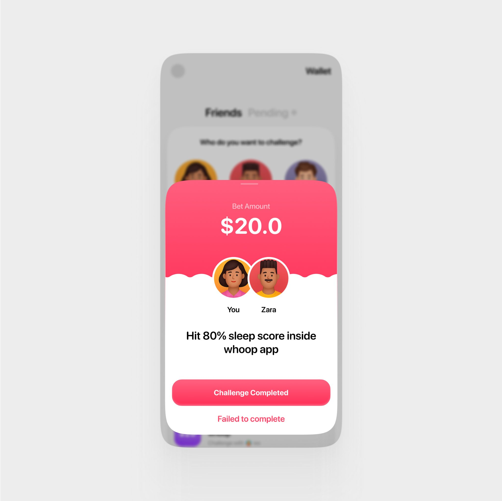
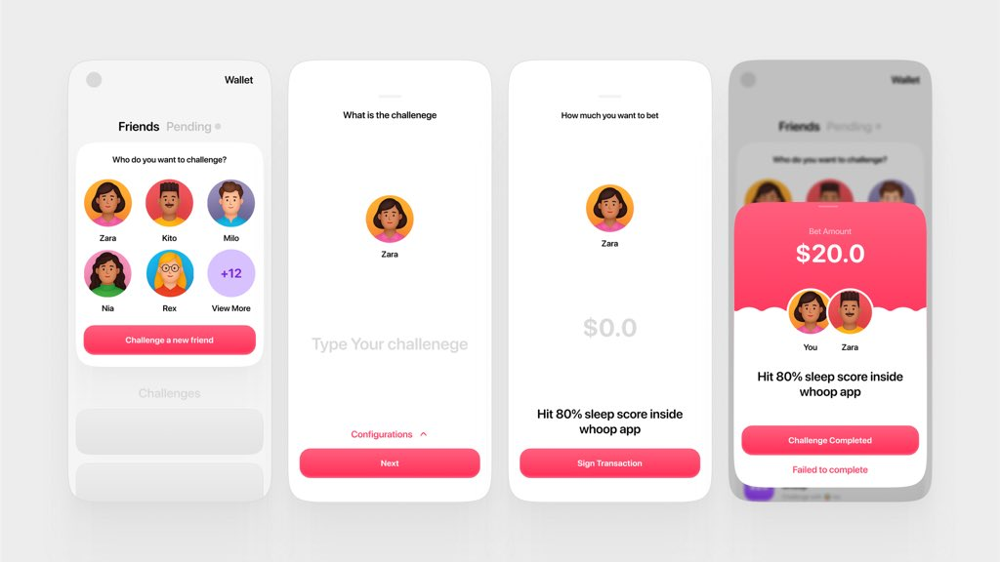

# Chum Bucket

Welcome to Chum Bucket, a fun and social Web3 app on Solana where you can challenge your friends, lock crypto tokens, and keep each other accountable! Built for the Solana Mobile ecosystem, Chum Bucket makes goal-setting exciting by letting you bet SOL or CHUM tokens on dares with friends.

## What is Chum Bucket?

Chum Bucket is a simple mobile app that lets you:

- **Create Challenges:** Dare your friends to achieve goals (e.g., "Run 5 miles this week").
- **Lock Tokens:** Bet SOL or CHUM tokens in a secure escrow on Solana.
- **Stay Accountable:** The challenge creator decides the winner, releasing funds to the victor.
- **Transparent Fees:** We take a 1% fee (capped at $10), with 50% for the team and 50% airdropped to Solana users (Seeker/Warpcast).

Launched on June 1, 2025, Chum Bucket is designed to bring friends together through fun, crypto-powered challenges, all while leveraging Solana's fast and low-cost blockchain.

## Features

- **Social Dares:** Create text-based challenges with friends using their email or wallet address.
- **Secure Escrow:** Lock SOL or CHUM tokens in a Solana smart contract until the challenge is complete.
- **Single-Sign Release:** The challenge creator signs to release funds to the winner, keeping it simple.
- **Fee Transparency:** 1% fee (max $10) is sent to a public wallet—check it on Solscan!
- **Flutter-Powered UI:** Smooth and intuitive interface for iOS and Android, built with Flutter.
- **Solana Mobile Integration:** Available on Solana Mobile's dApp Store, optimized for Seeker devices.

## Images

Below are some screenshots of Chum Bucket in action! (Image heights are reduced for better readability.)

<p align="center">
  
  
  
</p>

_Replace path/to/screenshotX.png with the actual paths to your images (e.g., in a /screenshots folder in your repo)._

## Tech Stack

- **Frontend:** Flutter for a seamless mobile experience on iOS and Android.
- **Backend:** Supabase for off-chain data storage (challenges, fees) and authentication.
- **Blockchain:** Solana for fast, low-cost transactions.
- **Smart Contract:** Anchor (Rust) for secure escrow and fee handling.
- **Authentication:** Privy with Google login, synced with Supabase.

## Getting Started

### Prerequisites

- A Solana wallet (e.g., Phantom) with SOL for transactions.
- A Solana Mobile device (like Seeker) or any iOS/Android device for testing.
- Flutter installed for development (if you're contributing).

### Installation

1. **Clone the Repo:**

```bash
git clone https://github.com/yourusername/chum-bucket.git
cd chum-bucket
```

2. **Install Dependencies:**

```bash
flutter pub get
```

3. **Set Up Supabase:**

   - Create a Supabase project and add your API keys to lib/config.dart.
   - Set up the challenges and fees tables as described in the Backend Setup section.

4. **Set Up Solana Smart Contract:**

   - Deploy the Anchor smart contract to Solana (devnet for testing, mainnet for production).
   - Update the program ID in your Flutter app.

5. **Run the App:**

```bash
flutter run
```

## Usage

1. Log in with Google via Privy.
2. Create a challenge: Add a friend (via email or wallet), set a bet amount, and write a dare.
3. Lock SOL/CHUM tokens in the escrow.
4. Once the challenge is done, the creator signs to release funds to the winner.
5. Check the public wallet for fee transparency on Solscan.

## Smart Contract Details

- **Escrow:** Locks SOL/CHUM tokens in a program-derived address (PDA).
- **Fee Handling:** Takes a 1% fee (max $10) and sends it to a public wallet.
- **Single-Sign:** Only the creator can sign to release funds to the winner.
- **Transparency:** Fees are split 50% for the team, 50% for airdrops to Solana users.

View the smart contract on Solscan (replace with your public wallet address).

## Backend Setup

The backend/middleware uses Supabase for off-chain data and authentication with Privy:

- **Challenges Table:** Stores challenge details (creator, friend, bet amount, status).
- **Fees Table:** Logs 1% fees for transparency.
- **Auth:** Syncs with Privy/Google for seamless login.
- **Real-Time:** Updates challenge status in the app instantly.

To set up Supabase:

1. Create a project at Supabase.
2. Set up tables (challenges, fees) via SQL Editor.
3. Enable Google OAuth for authentication.
4. Add your Supabase URL and key to the Flutter app.

## Tokenomics (CHUM Token)

We're launching the CHUM token when we launch on the store, with more details soon

- **Airdrop Plan:** 50% of fees will be airdropped to selected Solana users on Seeker.

## Contributing

We welcome contributions! To get started:

1. Fork the repo.
2. Create a new branch (`git checkout -b feature/your-feature`).
3. Commit your changes (`git commit -m "Add your feature"`).
4. Push to your branch (`git push origin feature/your-feature`).
5. Open a Pull Request.

Please follow the Code of Conduct (CODE_OF_CONDUCT.md).

## License

This project is licensed under the MIT License—see the LICENSE file for details.

## Contact

Have questions? Reach out:

- **Email:** immadominion@gmail.com
- **Twitter:** @Heisjoel0x
