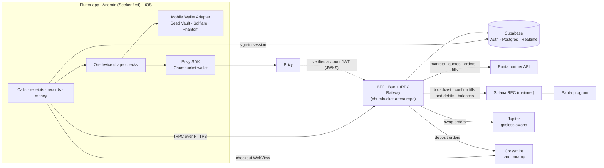

# Chumbucket

**FOMO for prediction markets.** See who called it, back them or fade them, and keep the receipt.

People make public YES/NO calls on live [Panta](https://panta.market) prediction markets on Solana. Anyone can Back or Fade a call for free, or Tail/Fade it with real USDC through a Panta trade signed by their own wallet. Each call is locked with its time and entry price, becomes a receipt nobody can edit, and adds to that person's track record.

[**Download the APK**](https://github.com/Immadominion/Chum-Bucket/releases/latest/download/chumbucket.apk) · [Web app](https://chumbucket.fun/app) · [Website](https://chumbucket.fun) · [Backend repo](https://github.com/Immadominion/chumbucket-arena)

> Funded calls are real money on Solana mainnet: prices move and you can lose what you put in. Check that prediction markets are legal where you live.

---

## Download

| | |
|---|---|
| **Android APK** | [`chumbucket.apk`](https://github.com/Immadominion/Chum-Bucket/releases/latest/download/chumbucket.apk), the latest GitHub release. Android 9+ (API 28), ARM phones: Seeker, Saga and most Android devices. |
| **Install** | Open the downloaded file. When Android asks, allow **Install unknown apps** for your browser or Files app, then tap Install. |
| **Solana dApp Store** | Chumbucket is already listed (search "Chumbucket"). The store update for this release (1.0.34) is drafted in [`publishing/`](publishing/LISTING.md) but **not submitted yet**, so the store may still serve an older build. Use the APK to try this version. |
| **iPhone / desktop** | Use the [web app](https://chumbucket.fun/app). The same Flutter code targets iOS 17+. |

Sign in with Google, X, or a Solana wallet.

---

## What you can do

- **Call it.** Pick YES or NO on a live Panta market and say why. The call is locked with the time and the entry price.
- **Back, Fade or Dare** anyone's call, for free.
- **Put money on it.** Tail or Fade with USDC: this makes your own call on the same (or opposite) side, funded by a real Panta buy that you sign.
- **Receipts.** Every call settles to Correct, Incorrect or Void and can be shared as a `chumbucket.fun` link. On Android those links open in the app.
- **Track record.** Shown per category, and it includes misses. Accuracy only appears once someone has enough decided calls. Free and funded calls are counted separately, and a funded call only counts after its fill is confirmed.
- **People.** Follow callers and find friends by X handle, @username or wallet. Activity inbox and push notifications.
- **Wallets.** Connect a wallet app over Mobile Wallet Adapter (Seed Vault on Seeker, Solflare, Phantom), or use the **Chumbucket wallet**: a Privy embedded wallet with no seed phrase.
- **One account, several sign-ins.** Link a wallet, X and Google to the same account.
- **Add funds.** Send USDC to your address (shown with a QR code), move it from your wallet app with one approval, or pay by card, Apple Pay or Google Pay through Crossmint.
- **Gas you never see.** If your wallet needs SOL for fees, a gasless Jupiter swap turns a little USDC into SOL first. You are never asked to hold SOL.
- **Cash out** USDC to any Solana address, and **collect winnings** from resolved positions.
- **Propose a market.** Proposals are reviewed before they are published to Panta.
- **Safety and account.** Report, block or mute people. Export your data or delete your account.

**Controlled by the server.** The release build ships with these features compiled in, and the BFF decides, account by account, what each person sees:

| Feature | Build flag (in `env.release.json`) | Server switch |
|---|---|---|
| Calls with money, balance, deposits, cash out, winnings | `MONEY_CALLS_ENABLED=true` | `money.status` |
| Chumbucket wallet (Privy) | `CHUMBUCKET_WALLET_ENABLED=true` | `wallet.status` |
| Linking sign-ins in Settings | n/a | `auth.signInMethods` (`linking`) |
| Card onramp (Crossmint) | n/a | `money.depositOptions` (shown with a "Test" label on staging) |
| Gasless SOL top-up | n/a | `solTopUp.status` |
| Market proposals and publishing | n/a | `marketCreation.status` |

---

## How it uses Solana and the Solana Mobile Stack

| Piece | What it does | Code |
|---|---|---|
| **Mobile Wallet Adapter** | `authorize`/`reauthorize` on mainnet-beta, with identity `chumbucket.fun`. Sign-In With Solana (`signMessages`) becomes a Supabase Web3 session, and `signMessages` also signs Crossmint's wallet-ownership proof. `signTransactions` is used for Panta buys and claims, USDC transfers from your wallet app, and gasless swaps. The phone only signs; the BFF broadcasts. | [`mwa_auth_provider.dart`](lib/features/authentication/providers/mwa_auth_provider.dart), [`solana_sign_in.dart`](lib/features/authentication/session/solana_sign_in.dart), [`panta_mwa_wallet.dart`](lib/features/authentication/session/panta_mwa_wallet.dart), [`panta_wallet_app.dart`](lib/features/embedded_wallet/panta_wallet_app.dart), [`money_transfer_signer.dart`](lib/features/money/domain/money_transfer_signer.dart), [`mwa_deposit_wallet_source.dart`](lib/features/deposits/data/mwa_deposit_wallet_source.dart) |
| **Panta (partner API + program)** | Funded calls are primary buys (`primary_order_usdc`) on Panta's mainnet program [`6gM5…ZMp`](https://explorer.solana.com/address/6gM5afTQBq5VZCfgpGqcsqzfWd5maLSCKWtGjbEobZMp), priced from Panta's partner API. The flow is below. | [`money_call_controller.dart`](lib/features/money/money_call_controller.dart), [`panta_trading_client.dart`](lib/features/panta_trading/data/panta_trading_client.dart), [`panta_trade_controller.dart`](lib/features/panta_trading/panta_trade_controller.dart), [`money_winnings_controller.dart`](lib/features/money/money_winnings_controller.dart) |
| **Privy embedded wallet** | The Chumbucket wallet: one non-custodial Solana wallet per account that works on Android, iPhone and the web. Privy signs the user in with the BFF's account JWT, checked against the BFF's JWKS. The wallet is linked to the account with the same SIWS proof as any other wallet. Signing only. | [`privy_chumbucket_wallet_backend.dart`](lib/features/chumbucket_wallet/privy_chumbucket_wallet_backend.dart), [`chumbucket_wallet_controller.dart`](lib/features/chumbucket_wallet/chumbucket_wallet_controller.dart), [`chumbucket_signers.dart`](lib/features/chumbucket_wallet/chumbucket_signers.dart) |
| **Jupiter gasless top-up** | When the server answers `NEEDS_GAS`, the app swaps exactly the USDC the server names into SOL. The route is Jupiter v6 or JupiterZ, and the fee is paid by Jupiter or the market maker. The phone checks the swap before any wallet sees it. | [`money_gas.dart`](lib/features/money/domain/money_gas.dart), [`sol_topup_controller.dart`](lib/features/sol_topup/sol_topup_controller.dart), [`gasless_swap_check.dart`](lib/features/sol_topup/domain/gasless_swap_check.dart) |
| **USDC transfers** | Cash out, and deposits from your own wallet app. Each is a single `TransferChecked` of mainnet USDC, checked on the phone before signing. | [`money_transfer_controller.dart`](lib/features/money/money_transfer_controller.dart), [`usdc_transfer_check.dart`](lib/features/money/domain/usdc_transfer_check.dart) |
| **Seeker specifics** | Seed Vault signing over MWA. `.skr` domains are shown as the display name when a wallet connects. Release APKs are ARM-only (Seeker and Saga are arm64). Android App Links cover `chumbucket.fun`. Store builds are pinned to the dApp Store signing certificate. | [`address_name_resolver.dart`](lib/shared/services/address_name_resolver.dart), [`AndroidManifest.xml`](android/app/src/main/AndroidManifest.xml), [`build_release.sh`](scripts/build_release.sh), [`publishing/config.yaml`](publishing/config.yaml) |

### A funded call, end to end

```text
money.prepareCall ── NEEDS_FUNDS → Add funds → prepareCall again (same idempotency key)
                  ├─ NEEDS_GAS   → gasless USDC→SOL swap → prepareCall again
                  └─ READY       → PENDING call (only its owner can see it) + Panta quote and unsigned v0 buy
1. Shape check on the phone (checkPantaBuyForEmbeddedSigning) – before any wallet opens
2. Sign: wallet app over MWA, Chumbucket wallet (Privy), or a key already on this phone
3. The answer must be the same message with only the owner's signature added (adoptSignerAnswer)
4. pantaTrading.submit → BFF re-verifies and broadcasts; after a lost reply the SAME bytes are resent
5. money.callStatus → FUNDED only after Panta confirms the fill AND the USDC debit is proven over RPC
```

Winnings follow the same steps: `pantaTrading.claimPrepare` → claim shape check → sign → `claimSubmit` → `pantaTrading.claim` until `CONFIRMED`.

---

## Architecture


```mermaid
flowchart LR
  subgraph Phone["Flutter app · Android (Seeker first) + iOS"]
    UI["Calls · receipts · records · money"]
    CHK["On-device shape checks"]
    MWA["Mobile Wallet Adapter<br/>Seed Vault · Solflare · Phantom"]
    PSDK["Privy SDK<br/>Chumbucket wallet"]
  end

  BFF["BFF · Bun + tRPC<br/>Railway<br/>(chumbucket-arena repo)"]
  SB[("Supabase<br/>Auth · Postgres · Realtime")]
  PAPI["Panta partner API"]
  RPC["Solana RPC (mainnet)"]
  PROG["Panta program"]
  JUP["Jupiter<br/>gasless swaps"]
  CM["Crossmint<br/>card onramp"]
  PRIVY["Privy"]

  UI -- "tRPC over HTTPS" --> BFF
  UI -- "sign-in session" --> SB
  UI --> CHK
  CHK --> MWA
  CHK --> PSDK
  PSDK --> PRIVY
  PRIVY -. "verifies account JWT (JWKS)" .-> BFF
  UI -- "checkout WebView" --> CM
  BFF --> SB
  BFF -- "markets · quotes · orders · fills" --> PAPI
  BFF -- "broadcast · confirm fills and debits · balances" --> RPC
  RPC --- PROG
  BFF -- "swap orders" --> JUP
  BFF -- "deposit orders" --> CM
```

- **The app never broadcasts and never holds a server secret.** It signs, and the BFF re-checks and sends. Provider keys (Panta, Jupiter, Crossmint, the Supabase service role) live only on the BFF.
- **Supabase schema:** [`supabase/migrations/`](supabase/migrations), covering calls, responses, results, money calls, wallet transfers, Panta trade sessions, linked wallets, sign-ins and trust.
- **Backend:** [Immadominion/chumbucket-arena](https://github.com/Immadominion/chumbucket-arena) has the BFF, the web app and the website.

---

## Build and run from source

**You need:** Flutter **3.44.2** stable (Dart 3.12; pinned in [`.github/workflows/ci.yml`](.github/workflows/ci.yml); `pubspec.yaml` needs Dart ≥ 3.7), JDK 17, the Android SDK (minSdk 28) with NDK 27.0.12077973, and an Android phone with a Solana wallet app. For iOS you need Xcode and CocoaPods (iOS 17+).

```bash
flutter pub get
flutter analyze                           # expect: No issues found
dart run tool/check_release_config.dart   # the release gate on the committed config
```

**Configuration.** There is no `.env` file (the old `.env.example` is legacy). Values are compiled in with `--dart-define-from-file`, and **every value is public**, because anyone can unzip an APK and read them.

| File | In git? | Keys |
|---|---|---|
| [`env.release.json`](env.release.json) | yes | `CALL_RECEIPT_EXPERIENCE`, `CALLS_BACKEND`, `CALLS_BFF_URL`, `CALLS_LINK_HOST`, `SOLANA_NETWORK`, `SOLANA_RPC_URL`, `SOLANA_MAINNET_RPC_URL`, `ARENA_BACKEND_URL`, `CHUMBUCKET_WALLET_ENABLED`, `MONEY_CALLS_ENABLED`, `CHUMBUCKET_PRIVY_APP_ID`, `CHUMBUCKET_PRIVY_CLIENT_ID` |
| `env.local.json` | no (gitignored) | `SUPABASE_URL`, `SUPABASE_ANON_KEY`. Supabase's public anon key, never the service-role key. The shape is in [`env.example.json`](env.example.json); for this setup the file needs only these two keys. |

[`tool/release_config.dart`](tool/release_config.dart) refuses a release that is off mainnet, not on the BFF, missing the Supabase keys, or carries a secret-shaped key name (`SECRET`, `PRIVATE`, `API_KEY`, ...) or a credential in a URL.

**Debug APK (anyone can build this, no signing key needed):**

```bash
flutter build apk --debug --dart-define-from-file=env.release.json
# → build/app/outputs/flutter-apk/app-debug.apk
```

This compiles and installs with only the committed file. Without `env.local.json` the app opens but **cannot sign in**, because Supabase is not configured. For a working build, put the two Supabase keys in `env.local.json`, connect a phone with USB debugging on, and pass both files:

```bash
flutter run --dart-define-from-file=env.release.json --dart-define-from-file=env.local.json
```

The prebuilt APK is the quickest way to try the full app.

**Signed release (maintainers):** `scripts/build_release.sh` (add `--aab` for Play, or `--check-only` to only check the config). It merges the Supabase keys from your environment or `env.local.json`, needs the upload key through `android/key.properties` or `CHUMBUCKET_KEY_PROPERTIES`, builds an ARM-only APK, and deletes the APK if its signer is not the certificate pinned in `publishing/config.yaml`.

---

## Safety

- **Non-custodial.** Every trade, claim, deposit and cash out is signed by the user's own wallet: a wallet app over MWA, or the Privy-backed Chumbucket wallet. The app signs and the BFF broadcasts. Chumbucket never holds keys or funds.
- **The phone checks every transaction before it signs.** It decodes each transaction and refuses anything that does not match what you reviewed. For a buy, that means one v0 transaction, you as the only signer and fee payer, compute budget within caps, your own USDC account, exactly one Panta buy for the reviewed market, side and amount, and the attribution memo. Any other program is refused, and so is any top-level SOL or token transfer. Claims, USDC transfers and Jupiter swaps have their own checks. Wallet apps get the same check before they open, even though they also show their own simulation. The BFF runs the same rules again on the server.
- **Signed bytes are pinned.** The signer's answer must be the reviewed message with only your signature added. A retry resends identical bytes and never asks you to sign again.
- **Funded means confirmed.** A signature is not a fill. A call shows as funded (for example "$5 on YES") only after the server sees Panta's fill and an RPC-proven USDC debit. Until then it is pending and visible only to its owner, and it never moves the track record.
- **Before the first funded trade**, the person confirms they are 18+, eligible where they live, and accept Panta's terms. The server records this and checks it again on every prepare ([`funded_trading_attestation_sheet.dart`](lib/features/trust/presentation/funded_trading_attestation_sheet.dart)).
- **No secrets in the client.** See the configuration rules above. Provider keys stay on the BFF.

---

## Repo map

| Path | What's there |
|---|---|
| `lib/features/calls` | Feed, markets, call detail, composer, Back/Fade/Dare, deep links |
| `lib/features/money` | Calls with money, balance, Add funds, cash out, winnings |
| `lib/features/panta_trading` | Panta BFF client, trade controller, transaction validator, positions |
| `lib/features/chumbucket_wallet` | Chumbucket wallet (Privy) and its signers |
| `lib/features/embedded_wallet` | Buy and claim shape checks, signer choice, the on-phone key some earlier accounts still have |
| `lib/features/sol_topup` | Jupiter gasless USDC→SOL top-up |
| `lib/features/deposits` | Add funds, Crossmint checkout |
| `lib/features/authentication` | MWA, Sign-In With Solana, Google/X, account linking, session continuity |
| `lib/features/{receipts,record,people,notifications,trust,market_creation}` | Receipts, track records, social graph, inbox and push, safety, market proposals |
| `lib/features/{arena,challenges}` | Legacy (read-only History) |
| `supabase/migrations` | Supabase schema and RLS |
| `tool/`, `scripts/` | Release config gate, signed release build |
| `publishing/` | Solana dApp Store config and listing copy |
| `test/` | 161 test files: unit, widget, flow and golden tests |
| `docs/` | Contracts and checkpoints |

**Tests**

```bash
flutter test $(ls test/*_test.dart | grep -v panta_trading_bff_contract_test)
```

This is exactly what CI runs. `panta_trading_bff_contract_test.dart` drives a local checkout of the BFF repo with `bun`, so it only runs on a machine that has that repo next to this one. Plain `flutter test` includes it.

**License:** [MIT](LICENSE).

---

## Links

- Website: <https://chumbucket.fun>
- Web app: <https://chumbucket.fun/app>
- Backend (BFF, web app, site): <https://github.com/Immadominion/chumbucket-arena>
- Panta: <https://panta.market>
- X: [@HeIsJoel0x](https://x.com/HeIsJoel0x)

**History:** Chumbucket began in 2025 as SOL friend challenges locked in a mainnet Pinocchio escrow, then Arena (TxLINE-settled football pots on devnet). Creating escrow challenges is retired; any that are still open stay in Settings > History, where their witness can settle them.
