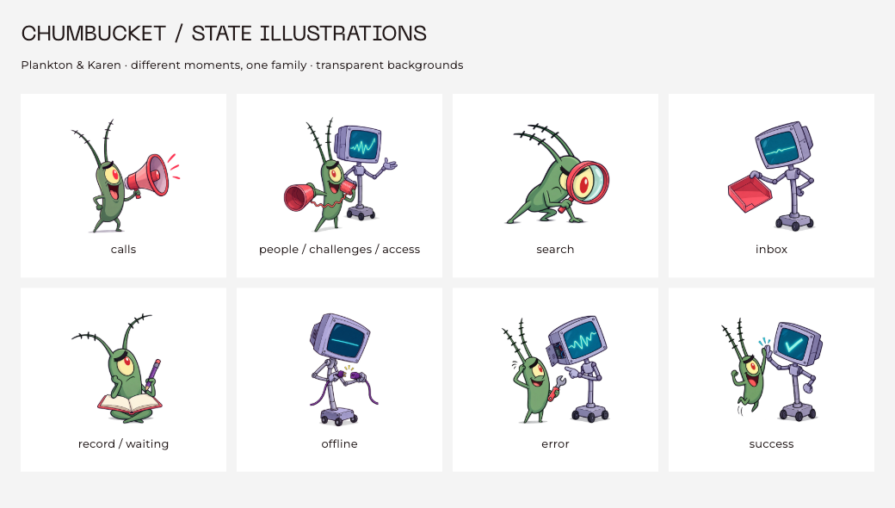

# Chumbucket state illustrations

Revised 2026-10-01 following the founder's direction: use Plankton and his wife
Karen, not the Chum Bucket building in every state. Generated with the built-in
image-generation tool. These are the requested recognizable characters from
SpongeBob, not new original mascots. The original app logo is unchanged.

Image-generation and design-system skills guided distinct little character
scenes with consistent ink, coral accents, compact sizing and live text. The
first house-based set was rejected; it remains recoverable in commit `8aa1fe3`
but is replaced in the asset bundle, not shipped alongside the character set.



## Assets and state inventory

All files live in `assets/images/states/`. Each is a separate, square 1254px PNG
with genuine alpha transparency, not a white background or a sprite-sheet crop.
The family is approximately 6.2 MiB. Flutter decodes displayed illustrations at
512px and loads them only when their state is shown.

| Asset | Meaning | Integrated surfaces |
| --- | --- | --- |
| `empty_calls.png` | Plankton calling out through a coral megaphone | Global call feed and the shared empty-call view |
| `people.png` | Plankton offers a tin-can phone; Karen welcomes you | Empty friends grid, Following feed, Following people card, empty All Friends sheet |
| `search.png` | Plankton plays detective, eye enlarged through a magnifier | Markets, market picker, empty open-market section in Predictions |
| `inbox.png` | Karen presents a genuinely empty inbox tray | Social inbox (All/Unread), original notification sheet |
| `record.png` | Plankton thinks over an unwritten notebook | Loaded-empty profile calls, person calls/record, original prediction-history empty state |
| `people.png` reused for challenges | A friendly invitation from Plankton and Karen | Original challenge list and challenge preview |
| `record.png` reused for waiting | Thoughtful Plankton; anticipation, not a decided outcome | Rematch's not-settled state |
| `offline.png` | Karen inspects two disconnected cable ends | Shared calls offline state and generic network-error widget |
| `error.png` | Plankton helps repair Karen's side panel | Shared calls error, friends load failure, Following failure, original inbox failure, generic error/loading-error widgets |
| `people.png` reused for access | A welcome from Plankton and Karen | Shared signed-out state and Following sign-in card |
| `success.png` | Plankton and Karen share a little high-five | Available in the shared library; deliberately not substituted for trading, claims or financial result evidence |

The call detail and market detail screens reuse the same shared error/offline/
signed-out components. No provider state, data retrieval, status derivation,
identity, trading eligibility or action callback was changed.

### States that deliberately keep their current treatment

- **Loading:** feed skeletons, list placeholders, spinners and wallet-approval
  progress remain progress indicators. An empty illustration must not imply a
  request has completed.
- **Stale/offline with cached content:** retain content plus the compact notice.
  Never replace usable cached rows with an offline illustration.
- **Inline validation, snackbar feedback, private/deleted invitation rows,
  webview errors and deep-link refusals:** retain concise live text/icons.
  Repeating a 144px illustration in each row would overwhelm the content.
- **Profile account connection and private positions unavailable:** retain the
  existing action rows and precise unavailable copy. Not having a positions
  reader is not evidence that the person has no positions.
- **Panta submitted/pending/filled/rejected/claim statuses, receipts, record
  scores, SOL-transfer results and original challenge lifecycle results:** keep
  their status-specific labels/indicators. No generic “success” scene is allowed
  to turn a submission into a fill or imply a winning resolution.
- **Original Arena routes outside the Panta default navigation:** the notification
  sheet and empty history use this family. Separate historic activity/call,
  matchday, caller-profile and caller-list placeholders retain their existing
  icons/text; the corresponding `calls`, `search`, `record` and `error` assets
  are available without redesigning those screens in this asset pass.
- **Unused generic `EmptyStateContainer`:** no live call sites were found; no
  extra migration was introduced simply to exercise the new library.

## Component contract

`lib/shared/widgets/chumbucket_state_art.dart` owns the typed asset mapping and
rendering. Choose a semantic enum explicitly; do not infer it from English copy
or an icon name.

```dart
const ChumbucketStateArt(ChumbucketStateArtwork.people); // 144dp
const ChumbucketStateArt.compact(ChumbucketStateArtwork.inbox); // 96dp

const CallsEmptyView(
  artwork: ChumbucketStateArtwork.record,
  title: 'Nothing on record yet',
  message: 'When they make a call, it shows up here.',
);
```

- The artwork has no words, prices, probability, balance, score or venue evidence.
- It is excluded from screen-reader semantics; adjacent live text conveys the
  state, and existing accessible actions remain available.
- 144dp for standalone states; 96dp for compact cards/sheets. No extra screen
  percentage, minimum panel height, spacer or artificial bottom gap.
- Keep at most one principal recovery action, never hide it behind the artwork.
- Missing artwork must not prevent reading the message or using its action.
- Do not show `success` for empty content. This pass specifically removes the
  old `done.json` celebration from the empty challenge list.

## Reproducibility

The exact prompts and original output paths are in [state-art-prompts.json](state-art-prompts.json).
The call, friends and offline scenes established the characters. Other scenes
used the friends illustration as a character/ink reference while changing the
action, angle, props and expression. A tool-side output rejection interrupted
the challenge/waiting requests in a concurrent batch. Neither delivered a
selected asset; these states reuse the completed invitation/thinking scenes.
The separate access generation was also rejected; it uses the completed welcome
scene. Success completed independently. Rejected/interrupted requests were not
retried through another tool, and no rejected output was recovered.

Eight distinct scenes serve eleven semantic states. No house illustration remains
in the selected family. Original generated outputs remain outside the project;
the app loads repository-local PNGs. The three unused house files were removed;
the rejected house family is recoverable from commit `8aa1fe3`.

`test/chumbucket_state_art_test.dart` verifies bundling, real transparent
backgrounds and substantial opaque artwork, decorative semantics, compact
dimensions, small-screen/2x-text recovery actions, unchanged loading/cached
notices, Add Friend action, empty challenge meaning and content-fit sheet height.
It also renders the contact-sheet golden above using actual Flutter widgets and
local fonts.

```sh
flutter test --no-pub test/chumbucket_state_art_test.dart
# Only after visually reviewing intentional artwork changes:
flutter test --no-pub --update-goldens test/chumbucket_state_art_test.dart
```
